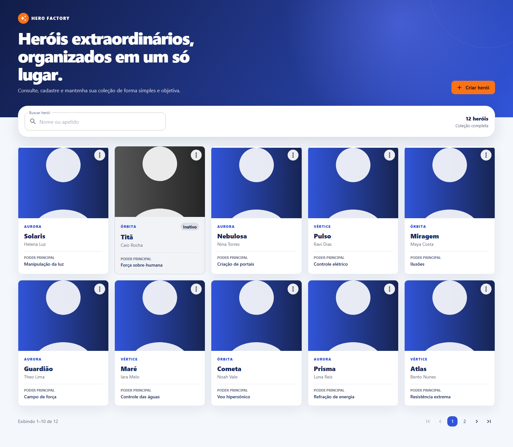
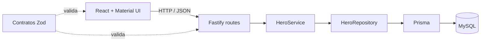

# Hero Factory

[](../../actions/workflows/ci.yml)

Aplicação full stack para cadastrar, consultar, editar, inativar e reativar heróis.
O projeto foi mantido intencionalmente pequeno: há uma única tela, uma API REST e
um banco relacional. A separação entre essas partes existe para deixar as regras
de negócio fáceis de localizar, testar e explicar.

## Demonstração



A captura acima é gerada pela própria aplicação em um teste Playwright. Os
dados são determinísticos para que o arquivo possa ser atualizado sem depender
de serviços externos: `npm run test:e2e:screenshot -w @hero-factory/web`.

## Funcionalidades

- criação e visualização de heróis;
- edição apenas de heróis ativos;
- exclusão lógica, mantendo o registro disponível para reativação;
- busca parcial por nome ou apelido, sem diferença entre maiúsculas, minúsculas
  e acentos;
- paginação de 10 itens e ordenação dos registros mais novos primeiro;
- indicação visual e textual para heróis inativos;
- estados de carregamento, lista vazia, erro e avatar indisponível;
- documentação interativa da API com OpenAPI.

## Stack

| Área           | Tecnologias                                                     |
| -------------- | --------------------------------------------------------------- |
| Base           | Node.js 24 LTS, npm workspaces e TypeScript estrito             |
| Interface      | React 19, Vite 8, Material UI, TanStack Query e React Hook Form |
| API            | Fastify 5, Zod e OpenAPI                                        |
| Persistência   | Prisma 7 e MySQL 8.4 LTS                                        |
| Testes         | Vitest, Testing Library, MSW, Testcontainers e Playwright       |
| Infraestrutura | Docker Compose, Nginx e GitHub Actions                          |

## Executar com Docker

### Pré-requisito

- Docker Desktop com Docker Compose.

Na raiz do projeto, execute:

```bash
docker compose up --build
```

O comando cria o banco, aplica as migrations, executa o seed e inicia API e
interface. Na primeira execução, o download das imagens e a construção dos
containers podem levar alguns minutos.

| Serviço               | Endereço                       |
| --------------------- | ------------------------------ |
| Aplicação             | <http://localhost:8080>        |
| API                   | <http://localhost:3333>        |
| Documentação OpenAPI  | <http://localhost:3333/docs>   |
| Healthcheck API/banco | <http://localhost:3333/health> |
| MySQL                 | `localhost:3306`               |

Para encerrar sem apagar os dados:

```bash
docker compose down
```

Para apagar também o volume do MySQL e começar novamente do seed:

```bash
docker compose down --volumes
```

> O último comando remove definitivamente os dados locais do banco.

## Desenvolvimento local com FNM

### Pré-requisitos

- [FNM](https://github.com/Schniz/fnm) para gerenciar o Node.js;
- Docker Desktop, usado pelo MySQL e pelos testes de integração.

O arquivo `.node-version` fixa a versão esperada. No PowerShell:

```powershell
fnm install 24.19.0
fnm use 24.19.0
node --version
npm ci
Copy-Item .env.example .env
docker compose up -d db
npm run db:migrate
npm run db:seed
npm run dev
```

No desenvolvimento local, a interface fica em <http://localhost:5173> e a API
em <http://localhost:3333>. Os workspaces de contratos, API e web são iniciados
em paralelo com recarregamento automático.

Se o FNM ainda não estiver carregado na sessão do PowerShell, execute antes:

```powershell
fnm env --use-on-cd --shell powershell | Out-String | Invoke-Expression
```

## Variáveis de ambiente

Copie `.env.example` para `.env`. Os valores fornecidos são apenas para o
ambiente local.

| Variável              | Finalidade                           | Valor local padrão        |
| --------------------- | ------------------------------------ | ------------------------- |
| `MYSQL_DATABASE`      | Nome do banco                        | `hero_factory`            |
| `MYSQL_USER`          | Usuário do MySQL                     | `hero_user`               |
| `MYSQL_PASSWORD`      | Senha do usuário                     | `hero_password`           |
| `MYSQL_ROOT_PASSWORD` | Senha administrativa local           | `root_password`           |
| `DATABASE_URL`        | Conexão usada pela API e pelo Prisma | MySQL em `localhost:3306` |
| `API_PORT`            | Porta HTTP da API                    | `3333`                    |
| `WEB_ORIGIN`          | Origem autorizada pelo CORS          | `http://localhost:5173`   |
| `VITE_API_URL`        | URL da API usada pela interface      | `http://localhost:3333`   |

Não reutilize as credenciais de exemplo em produção.

## Arquitetura



- **Web:** apresenta os dados e mantém somente estado de interface. O estado
  remoto, cache e invalidações ficam no TanStack Query.
- **API:** as rotas traduzem HTTP; o serviço contém as regras; o repositório
  trata persistência. Isso evita regras espalhadas em handlers ou componentes.
- **Contratos:** schemas Zod e tipos públicos compartilhados impedem que web e
  API descrevam um herói de maneiras diferentes.
- **Banco:** o Prisma implementa o repositório e mantém migrations reproduzíveis
  para MySQL.

### Estrutura do monorepo

```text
apps/
  api/           API Fastify, regras de negócio, Prisma e testes
  web/           SPA React, componentes e testes de interface/E2E
packages/
  contracts/     schemas Zod e tipos compartilhados
.github/
  workflows/     integração contínua
compose.yaml     ambiente completo em containers
```

## Contrato da API

| Método   | Endpoint                     | Comportamento                    |
| -------- | ---------------------------- | -------------------------------- |
| `GET`    | `/api/heroes?page=1&search=` | Lista e busca heróis             |
| `GET`    | `/api/heroes/:id`            | Retorna um herói                 |
| `POST`   | `/api/heroes`                | Cria um herói ativo              |
| `PUT`    | `/api/heroes/:id`            | Substitui os campos editáveis    |
| `DELETE` | `/api/heroes/:id`            | Inativa o herói                  |
| `PATCH`  | `/api/heroes/:id/status`     | Ativa ou inativa o herói         |
| `GET`    | `/health`                    | Verifica a API e a conexão MySQL |
| `GET`    | `/docs`                      | Abre a documentação OpenAPI      |

A listagem responde neste formato:

```json
{
  "data": [],
  "pagination": {
    "page": 1,
    "per_page": 10,
    "total": 0,
    "total_pages": 0
  }
}
```

Erros seguem uma estrutura previsível:

```json
{
  "error": {
    "code": "VALIDATION_ERROR",
    "message": "Revise os campos informados",
    "fields": {
      "name": ["Campo obrigatório"]
    }
  }
}
```

As entradas usam `YYYY-MM-DD` para a data de nascimento. As datas devolvidas
pela API seguem o contrato `YYYY-MM-DD HH:mm:ss`. Identificador UUID, status
inicial e timestamps são definidos pelo servidor.

## Scripts úteis

Todos os comandos são executados na raiz:

| Comando                    | O que faz                                                |
| -------------------------- | -------------------------------------------------------- |
| `npm run dev`              | Inicia contratos, API e web em modo de desenvolvimento   |
| `npm run build`            | Gera os builds dos três workspaces                       |
| `npm run format:check`     | Confere a formatação sem alterar arquivos                |
| `npm run lint`             | Executa as regras estáticas do ESLint                    |
| `npm run typecheck`        | Valida os tipos de todos os workspaces                   |
| `npm test`                 | Executa os testes unitários                              |
| `npm run coverage`         | Executa testes e verifica a cobertura configurada        |
| `npm run test:integration` | Testa a API contra MySQL real via Testcontainers         |
| `npm run test:e2e`         | Executa o fluxo principal no navegador com Playwright    |
| `npm run db:migrate`       | Aplica as migrations pendentes                           |
| `npm run db:seed`          | Insere novamente o conjunto inicial de forma idempotente |

Os testes de integração precisam que o Docker esteja em execução. Por padrão,
o E2E inicia o build local do frontend e usa uma API determinística no próprio
Playwright, o que permite revisar rapidamente todo o fluxo de interface.

Para validar o mesmo fluxo contra a API e o MySQL reais, suba a solução e
informe o endereço externo ao Playwright. No PowerShell:

```powershell
docker compose up -d --build --wait
$env:PLAYWRIGHT_BASE_URL = 'http://127.0.0.1:8080'
npm run test:e2e
Remove-Item Env:PLAYWRIGHT_BASE_URL
```

A CI usa essa segunda modalidade para validar a integração completa.

## Estratégia de testes

- **Contratos:** formatos aceitos, normalização e mensagens de validação.
- **Serviço:** regras de criar, editar, inativar e reativar usando repositório
  em memória, sem banco.
- **Integração:** migration, rotas, erros, busca, paginação e persistência em
  MySQL real iniciado pelo Testcontainers.
- **Interface:** estados visuais, formulário, menus e feedback com Vitest,
  Testing Library e MSW.
- **E2E:** fluxo criar, visualizar, editar, inativar e reativar no Playwright.

A meta de 80% se aplica ao código de negócio. Arquivos gerados, configuração e
bootstrap não entram nessa conta porque aumentariam o número sem testar regras
relevantes.

O workflow de CI repete formatação, lint, tipos, cobertura, build, integração e
E2E em ambiente limpo. Assim, “funciona na minha máquina” não é critério de
aprovação.

## Decisões técnicas

Esta seção registra **a decisão, o motivo e a consequência prática**. O objetivo
é tornar as escolhas auditáveis, não afirmar que existe uma única solução certa.

| Decisão                       | Motivo                                                                       | Consequência                                                                                                                                          |
| ----------------------------- | ---------------------------------------------------------------------------- | ----------------------------------------------------------------------------------------------------------------------------------------------------- |
| Monorepo com npm workspaces   | Web, API e contratos pertencem ao mesmo produto e evoluem juntos.            | Uma instalação atende tudo, mas cada pacote continua com responsabilidade própria.                                                                    |
| TypeScript em todo o projeto  | O mesmo modelo precisa atravessar navegador e servidor.                      | Erros de contrato aparecem durante o desenvolvimento, antes da chamada HTTP.                                                                          |
| Contratos Zod compartilhados  | Duplicar validação facilita divergências silenciosas.                        | `packages/contracts` é a fonte de verdade e não depende do Prisma.                                                                                    |
| React com Vite                | A interface é uma SPA de uma tela e não precisa de renderização no servidor. | O ambiente é rápido e menor, sem a estrutura adicional de um framework SSR.                                                                           |
| Fastify                       | A API precisa de baixo acoplamento, validação e documentação OpenAPI.        | Rotas e plugins ficam explícitos, com pouca infraestrutura.                                                                                           |
| Prisma 7                      | Migrations e acesso tipado deixam a camada MySQL mais legível.               | A persistência ganha código gerado, mas esse detalhe fica atrás do repositório. A versão 7 foi escolhida por oferecer suporte ao MySQL nesta solução. |
| Service + Repository          | Regra de negócio não deve depender de HTTP nem de Prisma.                    | O serviço pode ser testado com um repositório em memória, sem introduzir DDD completo ou container de injeção.                                        |
| TanStack Query                | Dados da API têm cache, carregamento, erro e invalidação próprios.           | Componentes não precisam duplicar esse controle; estados locais continuam no React.                                                                   |
| Exclusão lógica               | Um herói “excluído” precisa permanecer disponível para reativação.           | O registro recebe `is_active=false`; não há perda física de dados.                                                                                    |
| `PUT` para edição             | O formulário envia o conjunto completo de campos editáveis.                  | A intenção de substituição fica clara e campos ausentes não são interpretados silenciosamente.                                                        |
| `PATCH` para status           | A operação muda somente `is_active`.                                         | Ativar e inativar têm um contrato pequeno e idempotente.                                                                                              |
| Busca e paginação no servidor | A tela não pode depender apenas dos registros já carregados.                 | Contagem, filtro e páginas permanecem corretos à medida que o banco cresce.                                                                           |
| Formato de data do contrato   | O formato `YYYY-MM-DD HH:mm:ss` faz parte da saída esperada.                 | Ele foi preservado mesmo que ISO 8601 seja mais comum em novas APIs.                                                                                  |
| Docker Compose completo       | O avaliador precisa reproduzir o ambiente sem configurar MySQL manualmente.  | Um comando sobe banco, migration, seed, API e web.                                                                                                    |
| Sem Redux ou React Router     | Há uma tela e nenhum estado global complexo.                                 | Menos conceitos e dependências para manter; podem ser adicionados quando houver necessidade real.                                                     |
| Sem autenticação              | Não existe requisito de identidade ou autorização neste escopo.              | A entrega foca o CRUD e não cria segurança incompleta apenas para demonstrar tecnologia.                                                              |

## Trade-offs e melhorias futuras

- A busca com `%termo%` é simples e adequada ao volume proposto. Em grande
  escala, um índice full-text ou serviço de busca seria avaliado.
- A paginação por número é clara para esta interface. Cursor seria mais estável
  para listas muito grandes e atualizadas continuamente.
- Avatares são URLs externas e podem deixar de responder. A interface oferece
  fallback; armazenamento próprio seria uma evolução separada.
- Não há Redis, fila nem microserviços porque nenhum problema atual exige essas
  peças. Adicioná-las agora aumentaria implantação e depuração.
- O repositório isola o Prisma e permitiria trocar a persistência, mas a solução
  não cria camadas extras para uma troca apenas hipotética.
- O frontend gera um único bundle porque há somente uma tela. Se novas áreas
  forem adicionadas, divisão por rota e carregamento sob demanda passam a fazer
  sentido.
- Autenticação, observabilidade distribuída e rate limiting seriam avaliados
  antes de uma exposição pública, com requisitos concretos de usuários e carga.

## Critérios de qualidade

- TypeScript em modo estrito;
- formatação e lint verificados automaticamente;
- validação de entrada e erros HTTP consistentes;
- proteção contra editar herói inativo também no backend;
- estados acessíveis e feedback para todas as operações na interface;
- seed idempotente com mais registros do que uma página;
- execução reproduzível localmente e na CI.

## Licença

Distribuído sob a licença MIT. Consulte [LICENSE](LICENSE).
